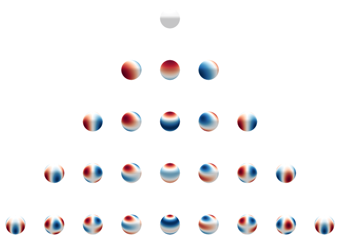
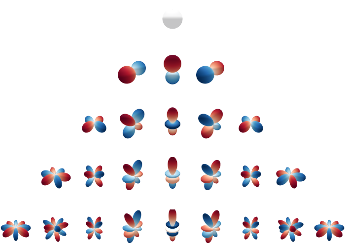

# Spherical Harmonics

Visualizations of spherical harmonics.

See also my [post on circular harmonics](https://github.com/mkofinas/circular-harmonics).

## Sources

- https://irhum.github.io/blog/spherical-harmonics/
- https://blondegeek.github.io/e3nn_tutorial/data_types.html
- https://docs.e3nn.org/en/latest/api/o3/o3_sh.html
- https://uvagedl.github.io/
